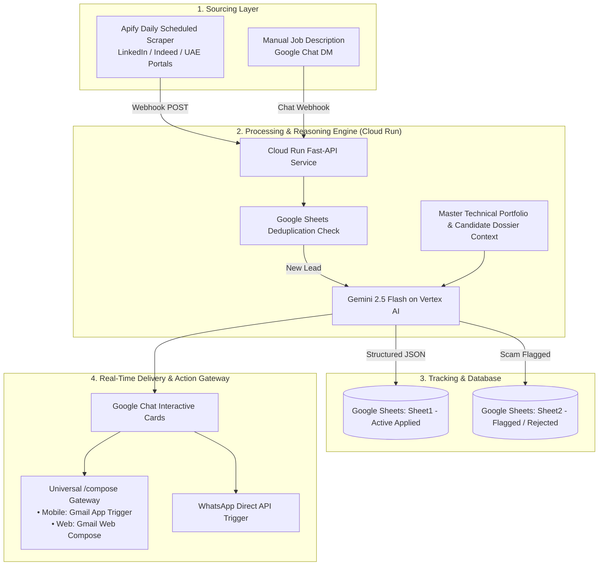

# 🚀 Autonomous Job Ingestion, Auditing & Outreach Agent

An end-to-end autonomous AI system that sources job postings (via Apify scheduled scrapers or Google Chat), evaluates them for visa sponsorship & scam risks using **Google Gemini 2.5 Flash**, syncs the data in real-time to **Google Sheets**, and delivers interactive **1-Tap Outreach Cards** (`✉️ Gmail Draft` & `📱 WhatsApp`) to **Google Chat**.

---

## 🏗️ Architecture



---

## ✨ Key Features

* **⚡ Zero-Touch Sourcing:** Ingests newly scraped jobs from Apify on a recurring schedule in Dubai GST timezone.
* **🧠 Evidence-First Value Pitching:** Gemini 2.5 Flash maps the target job's specific requirements directly to the candidate's Master Technical Portfolio, quoting concrete metrics ($55.3M revenue tracking with PostgreSQL/DAX, +11.5% pricing optimization, ML models).
* **✉️ Universal 1-Tap Compose Gateway (`/compose`):**
  * **Mobile (iOS / Android):** Deep-links directly into the native **Gmail App** with pre-filled subject, recruiter email, and evidence-first pitch.
  * **Desktop / Laptop Web:** Automatically redirects to **Gmail Web Compose**.
* **🛡️ Scam & Visa Sponsorship Verification:** Flags free personal email domains (@gmail, @yahoo) used for enterprise brands, categorizing fraudulent listings into an archive sheet.
* **📊 Dual Google Sheets Database:**
  * **Sheet1:** Active applied pipeline with follow-up dates (auto-set to T+3 days).
  * **Sheet2:** Flagged/rejected leads archive with audit reason notes.

---

## 🛠️ Tech Stack

* **AI & LLM:** Google Gemini 2.5 Flash via `google-genai` SDK & Google Cloud Vertex AI
* **Cloud Infrastructure:** Google Cloud Run (Containerized FastAPI), Google Cloud Build, Artifact Registry
* **APIs & Integrations:** Google Chat API (Cards v2), Google Sheets API v4, Apify Dataset API
* **Language & Frameworks:** Python 3.11+, FastAPI, Pydantic, Uvicorn, Requests

---

## 📂 Project Structure

```
├── cloud-function/               # Core Cloud Run FastAPI Service
│   ├── main.py                   # Webhooks, Gemini auditor, Sheet sync & Gateway
│   ├── Dockerfile                # Container definition
│   ├── requirements.txt          # Python dependencies
│   └── profile/                  # Candidate resume & master technical portfolio
├── apps-script/                  # Google Apps Script utilities & webhook handlers
├── agent-backend/                # Reasoning Engine & deployment scripts
├── .gitignore                    # Secrets & credentials protection
└── README.md                     # Documentation
```

---

## ⚙️ Configuration & Deployment

### 1. Prerequisites
* Google Cloud Platform Project with Vertex AI, Cloud Run, and Google Sheets APIs enabled.
* Service Account with `roles/aiplatform.user`, `roles/editor`, and Google Sheets access.
* Apify account for automated scraping.

### 2. Cloud Run Deployment
```bash
gcloud run deploy job-auditor-service \
  --source ./cloud-function \
  --region us-central1 \
  --allow-unauthenticated \
  --project YOUR_GCP_PROJECT_ID
```

### 3. Apify Webhook Setup
In your Apify Actor (e.g. `curious_coder/linkedin-jobs-scraper`):
* **Event:** `Run succeeded` (`ACTOR.RUN.SUCCEEDED`)
* **URL:** `https://<YOUR_CLOUD_RUN_URL>/apify-webhook?space=spaces/<YOUR_SPACE_ID>&token=<YOUR_APIFY_TOKEN>`

---

## 👤 Author
**Thabeeb Jafran**  
*Lead BI & Analytics Engineer | AI Solutions Architect*  
[LinkedIn Profile](https://www.linkedin.com/in/thabeebjafran)
